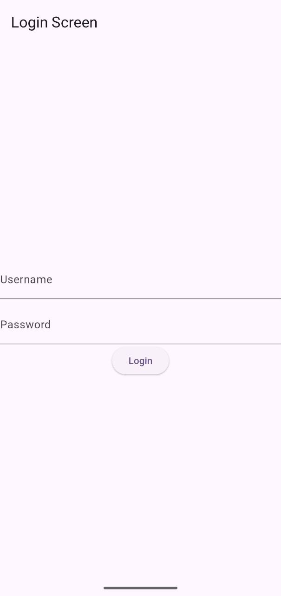

\# Flutter Task Manager

The objective of this project was to simulate real-world mobile application patterns including authentication lifecycle management, secure persistence, and scalable state architecture.

Production-style Flutter application demonstrating authentication handling, secure token persistence, REST API integration, and layered architecture using Provider.

This project focuses on clean architecture, separation of concerns, and predictable state handling suitable for junior-level production applications.

---

\## Features

\- User authentication using REST API

\- Secure token storage with flutter\_secure\_storage

\- Persistent session with auto-login logic

\- Task CRUD operations (Create, Read, Update, Delete)

\- Swipe-to-delete with Undo (SnackBar)

\- Toggle task completion state

\- Loading and error state handling

\- Structured folder separation (data / state / ui)

---

\## Architecture Overview

The application follows a layered structure:

lib/

├── data/

│ ├── models/

│ └── services/

├── state/

│ └── providers/

├── ui/

│ ├── screens/

│ └── widgets/

\### State Management

\- ChangeNotifier + Provider

\- Single Source of Truth (SSOT) pattern

\- Business logic separated from UI layer

\### API Layer

\- Network calls isolated in service classes

\- JSON parsing handled inside models

\- Explicit loading, success, and error states

\### Authentication Flow

1\. User logs in via API

2\. Token is stored securely

3\. App checks stored token on startup

4\. If valid → navigate to task screen

5\. If missing → redirect to login

---

\## What This Project Demonstrates

\- Managing application state across multiple screens

\- Handling asynchronous REST API calls safely

\- Designing clean and maintainable folder structure

\- Separating UI from business logic

\- Implementing secure local persistence

---

\## Future Improvements

\- Token expiration handling (401 response logic)

\- Repository pattern implementation

\- Unit testing for providers and models

\- Full backend integration instead of mock API

\- Offline-first capability

---

## Tech Stack

- Flutter (UI Framework)
- Dart (Programming Language)
- Provider (State Management)
- HTTP (API Communication)
- flutter_secure_storage (Secure Token Storage)
- DummyJSON API (Authentication & Task Data)

## Setup Instructions

1. Clone the repository
2. Run `flutter pub get`
3. Ensure internet connection (uses dummyjson.com API)
4. Run `flutter run`

## Application Screenshots

### Login Screen

### Task List

### Add Task

### Filter Completed Tasks

